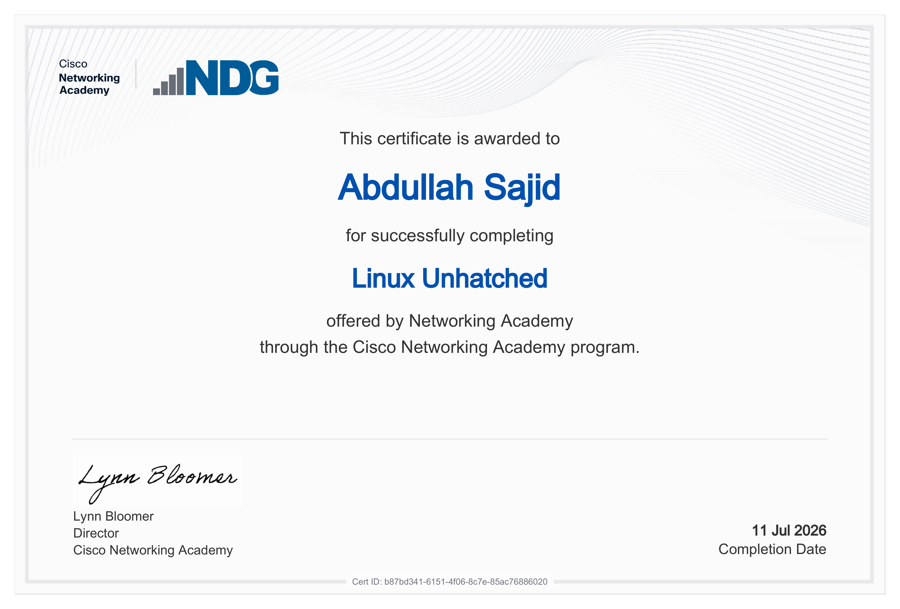

# Day 17: Cisco NDG Linux Certification 🌐🐧

Welcome to Day 17 of my Linux System Administration & DevOps journey. 
Today's focus shifted to validating my Linux fundamentals through an 
official certification — completed the **Linux Unhatched** course via 
Cisco Networking Academy's NDG track.

---

## 📖 1. Certification Details

**Course:** Linux Unhatched
**Issued by:** Cisco Networking Academy (NDG)
**Awarded to:** Abdullah Sajid
**Completion Date:** 11 Jul 2026
**Cert ID:** b87bd341-6151-4f06-8c7e-85ac76886020

---

## 🐧 2. What This Course Covered

- Structured, industry-recognized Linux fundamentals
- Hands-on lab exercises through the Cisco Networking Academy platform
- Reinforced command-line proficiency built across Day 1–16

---

## 🔜 3. Next Step

Continuing with **NDG Linux Essentials** as the next course in the 
Cisco Networking Academy track.

---

## 📜 Certificate

